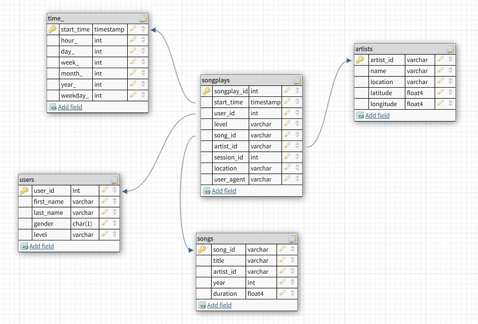

# Project: Data Modeling with Postgres

## Introduction

A startup called Sparkify wants to analyze the data they've been collecting on songs and user activity on their new music streaming app. The analytics team is particularly interested in understanding what songs users are listening to. Currently, they don't have an easy way to query their data, which resides in a directory of JSON logs on user activity on the app, as well as a directory with JSON metadata on the songs in their app. The aim of this project is to create a Postgres database with tables designed to optimize queries on song play analysis.

## Project Datasets

### Song Dataset

The first dataset is a subset of real data from the [Million Song Dataset](https://labrosa.ee.columbia.edu/millionsong/). Each file is in JSON format and contains metadata about a song and the artist of that song. The files are partitioned by the first three letters of each song's track ID. For example, here are filepaths to two files in this dataset.

```
song_data/A/B/C/TRABCEI128F424C983.json  
song_data/A/A/B/TRAABJL12903CDCF1A.json
```

And below is an example of what a single song file, TRAABJL12903CDCF1A.json, looks like.

```json
 {"num_songs": 1, "artist_id": "ARJIE2Y1187B994AB7", "artist_latitude": null, "artist_longitude": null, "artist_location": "", "artist_name": "Line Renaud", "song_id": "SOUPIRU12A6D4FA1E1", "title": "Der Kleine Dompfaff", "duration": 152.92036, "year": 0}
 ```

### Log Dataset
The second dataset consists of log files in JSON format generated by this [event simulator](https://github.com/Interana/eventsim) based on the songs in the dataset above. These simulate activity logs from a music streaming app based on specified configurations.

The log files in the dataset are partitioned by year and month. For example, here are filepaths to two files in this dataset.

```
log_data/2018/11/2018-11-12-events.json
log_data/2018/11/2018-11-13-events.json
```

And below is an example of what the data in a log file, ```2018-11-12-events.json```, looks like:


## Schema for Song Play Analysis
A database schema was created for queries on song play analysis.



The star schema includes the following tables (with ***italic bold*** fields as primary key):
 
### Fact Table
1. **songplays** - records in log data associated with song plays i.e. records with page NextSong  
    * ***songplay_id***, *start_time, user_id, level, song_id, artist_id, session_id, location, user_agent*

### Dimension Tables
2. **users** - users in the app
    - ***user_id***, *first_name, last_name, gender, level*
3. **songs** - songs in music database  
  - ***song_id***, *title, artist_id, year, duration*  
4. **artists** - artists in music database  
  - ***artist_id***, *name, location, latitude, longitude*  
5. **time** - timestamps of records in songplays broken down into specific units
    - ***start_time***, *hour, day, week, month, year, weekday*


* For ```songplays``` table, *songplay_id* is a unique number created when inserting the songplay records.
* For ```users```, ```songs``` and ```artists``` tables, their primary keys are extracted from ```song_data``` and ```log_data``` datasets.
* For ```time``` table, the primary key is *start_time*, which is the timestamp of the song being played, recorded in milliseconds.

## Project Files
  In addition to the data files, this project also includes other six files:  
  1. ```test.ipynb``` displays the first few rows of each table.
  2. ```create_tables.py``` drops and creates the tables. Run this file to reset the tables before running the ETL scripts.
  3. ```etl.ipynb``` reads and processes a single file from ```song_data``` and ```log_data``` and loads the data into the tables. This notebook contains detailed instructions on the ETL process for each of the tables.
  4. ```etl.py``` reads and processes files from ```song_data``` and ```log_data``` and loads them into the tables.
  5. ```sql_queries.py``` contains all the sql queries, and is imported into the last three files above.
    *  *DROP TABLES* queries: Drop any tables in the database if they exist.
    *  *CREATE TABLES* queries: Create all the tables in the database with appropriate data types and conditions.
    *  *INSERT RECORDS* queries: Insert records into the tables.
    *  *FIND SONGS* query: This query joins the songs and artists tables to find the song ID and artist ID based on the title, artist name, and duration of a song.
  6. ```README.md``` provides the discussion on this project.

## Project Steps
Follow the below steps to create the Postgres database for Sparkify:  
1. Run ```create_tables.py``` to create the database and tables.
2. Run ```etl.py``` to process files from ```song_data``` and ```log_data``` and loads them into the tables.
3. Run ```test.ipynb``` to confirm the records are successfully inserted into each table.
