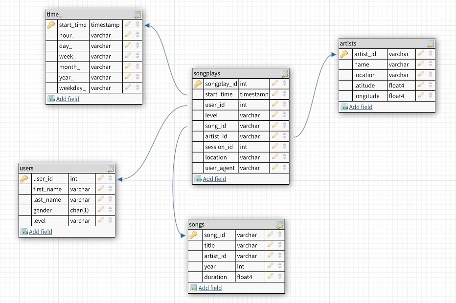

# Project: Cloud Data Warehousing

## Introduction

A music streaming startup, Sparkify, has grown their user base and song database and want to move their processes and data onto the cloud. Their data resides in S3, in a directory of JSON logs on user activity on the app, as well as a directory with JSON metadata on the songs in their app.   

The purpose of this project is to build an ETL pipeline that extracts their data from S3, stages them in Redshift, and transforms data into a set of dimensional tables for their analytics team to continue finding insights in what songs their users are listening to.


## Project Datasets

There are two datasets that reside in S3 for this project:

* Song data: `s3://udacity-dend/song_data`  
* Log data: `s3://udacity-dend/log_data`  

Log data json path: `s3://udacity-dend/log_json_path.json`

### Song Dataset

The first dataset is a subset of real data from the [Million Song Dataset](https://labrosa.ee.columbia.edu/millionsong/). Each file is in JSON format and contains metadata about a song and the artist of that song. The files are partitioned by the first three letters of each song's track ID. For example, here are filepaths to two files in this dataset.

```
song_data/A/B/C/TRABCEI128F424C983.json  
song_data/A/A/B/TRAABJL12903CDCF1A.json
```

And below is an example of what a single song file, TRAABJL12903CDCF1A.json, looks like.

```json
 {"num_songs": 1, "artist_id": "ARJIE2Y1187B994AB7", "artist_latitude": null, "artist_longitude": null, "artist_location": "", "artist_name": "Line Renaud", "song_id": "SOUPIRU12A6D4FA1E1", "title": "Der Kleine Dompfaff", "duration": 152.92036, "year": 0}
 ```

### Log Dataset
The second dataset consists of log files in JSON format generated by this [event simulator](https://github.com/Interana/eventsim) based on the songs in the dataset above. These simulate activity logs from a music streaming app based on specified configurations.

The log files in the dataset are partitioned by year and month. For example, here are filepaths to two files in this dataset.

```
log_data/2018/11/2018-11-12-events.json
log_data/2018/11/2018-11-13-events.json
```

And below is an example of what the data in a log file, ```2018-11-12-events.json```, looks like:


## Schema for Song Play Analysis
A database schema was created for queries on song play analysis.



The star schema includes the following tables (with ***italic bold*** fields as primary key):

### Fact Table
1. **songplays** - records in log data associated with song plays i.e. records with page NextSong  
    * ***songplay_id***, *start_time, user_id, level, song_id, artist_id, session_id, location, user_agent*

### Dimension Tables
2. **users** - users in the app
    - ***user_id***, *first_name, last_name, gender, level*
3. **songs** - songs in music database  
  - ***song_id***, *title, artist_id, year, duration*  
4. **artists** - artists in music database  
  - ***artist_id***, *name, location, latitude, longitude*  
5. **time** - timestamps of records in songplays broken down into specific units
    - ***start_time***, *hour, day, week, month, year, weekday*


* For ```songplays``` table, *songplay_id* is a unique number created when inserting the songplay records.
* For ```users```, ```songs``` and ```artists``` tables, their primary keys are extracted from ```song_data``` and ```log_data``` datasets.
* For ```time``` table, the primary key is *start_time*, which is the timestamp of the song being played, recorded in milliseconds.

## Project Files
  In addition to the data files, this project also includes other six files:  
  1. ```Project 3-Data Warehouse.ipynb```: This notebook contains detailed instructions to launch a Redshift cluster, load data from S3 to staging tables and then load data from staging tables to analytics tables.
  2. ```create_tables.py```: Create the staging, fact and dimension tables for the star schema in Redshift.
  3. ```etl.py```: Load data from S3 into staging tables on Redshift and then process that data into the analytics tables on Redshift.
  4. ```sql_queries.py``` contains all the sql queries, and is imported into the last two files above.
  5. ```README.md``` provides the discussion on this project.
