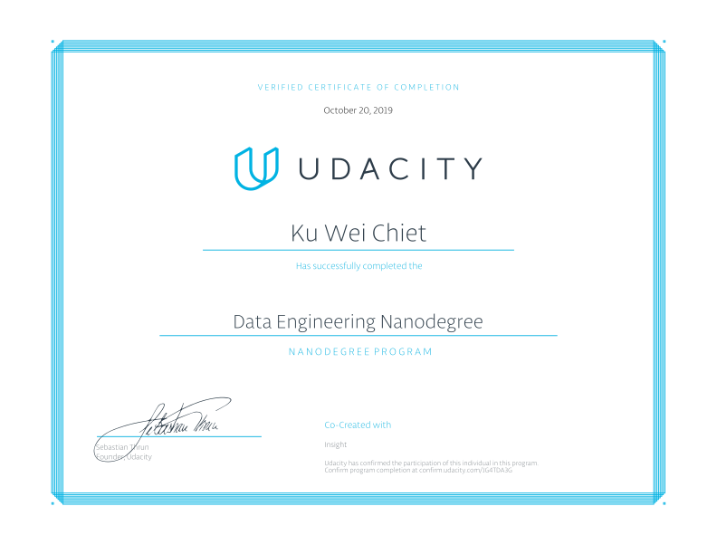

# Data Engineering Nanodegree

## Program Description

Learn to design data models, build data warehouses and data lakes, automate data pipelines, and work with massive datasets. At the end of the [program](https://www.udacity.com/course/data-engineer-nanodegree--nd027), you’ll combine your new skills by completing a capstone project.  

Educational Objectives: Students will learn to:  
*  Create user-friendly relational and NoSQL data models  
*  Create scalable and efficient data warehouses  
*  Work efficiently with massive datasets  
*  Build and interact with a cloud-based data lake  
*  Automate and monitor data pipelines  
*  Develop proficiency in Spark, Airflow, and AWS tools

[Graduation Certificate](https://confirm.udacity.com/JG4TDA3G)

## Course Syllabus
### 1. Data Modelings
In this course, you’ll learn to create relational and NoSQL data models to fit the diverse needs of data
consumers. You’ll understand the differences between different data models, and how to choose the
appropriate data model for a given situation. You’ll also build fluency in PostgreSQL and Apache Cassandra.

**[Project 1: Data Modeling with Postgres](./01_Data_Modeling_with_Postgres)**
* In this project, you’ll model user activity data for a music streaming app called Sparkify. You’ll create a relational database and ETL pipeline designed to optimize queries for understanding what songs users are listening to. In PostgreSQL you will also define Fact and Dimension tables and insert data into your new tables.  

**[Project 2: Data Modeling with Apache Cassandra](./02_Data_Modeling_with_Cassandra)**
* In this project, you’ll model user activity data for a music streaming app called Sparkify. You’ll model your data in Apache Cassandra to help the data team at Sparkify answer queries about app usage. You will set up your Apache Cassandra database tables in ways to optimize writes of transactional data on user sessions.  

### 2. Cloud Data Warehouses  
In this course, you’ll learn to create cloud-based data warehouses. You’ll sharpen your data warehousing skills, deepen your understanding of data infrastructure, and be introduced to data engineering on the cloud using Amazon Web Services (AWS).  

**[Project 3: Cloud Data Warehousing](./03_Data_Warehouse)**
* In this project, you are tasked with building an ETL pipeline that extracts their data from S3, stages them in Redshift, and transforms data into a set of dimensional tables for their analytics team to continue finding insights in what songs their users are listening to.  

### 3. Spark and Data Lakes
In this course, you will learn more about the big data ecosystem and how to use Spark to work with
massive datasets. You’ll also learn about how to store big data in a data lake and query it with Spark.  

**[Project 4: Data Lakes with Apache Spark](./04_Data_Lake)**
* In this project, you'll build an ETL pipeline for a data lake. The data resides in S3, in a directory of JSON logs on user activity on the app, as well as a directory with JSON metadata on the songs in the app. You will load data from S3, process the data into analytics tables using Spark, and load them back into S3. You'll deploy this Spark process on a cluster using AWS.  

### 4. Automate Data Pipelines  
In this course, you’ll learn to schedule, automate, and monitor data pipelines using Apache Airflow. You’ll learn to run data quality checks, track data lineage, and work with data pipelines in production.  

**[Project 5: Data Pipelines with Airflow](./05_Data_Pipelines)**
* In this project, you’ll continue your work on the music streaming company’s data infrastructure by creating and automating a set of data pipelines. You’ll configure and schedule data pipelines with Airflow and monitor and debug production pipelines.

**[Project 6: Data Engineering Capstone](./06_Capstone)**
* The purpose of the data engineering capstone project is to give you a chance to combine what you've learned throughout the program. You'll define the scope of the project and the data you'll be working with. You'll gather data from several different data sources; transform, combine, and summarize it; and create a clean database for others to analyze.
